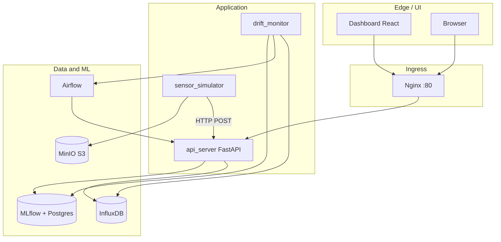
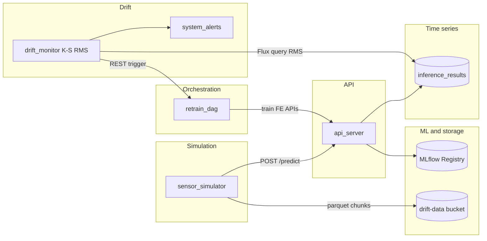

# CWRU Bearing Fault — MLOps Pipeline

Tài liệu mô tả **đặc tả kỹ thuật**, **tech stack** và **cách vận hành** một pipeline MLOps end-to-end cho bài toán phân loại tín hiệu rung động ổ bi (dataset CWRU): mô phỏng cảm biến → suy luận qua API → lưu time-series (InfluxDB) → phát hiện drift phân phối (Kolmogorov–Smirnov trên RMS) → cảnh báo và điều phối (Airflow) → huấn luyện lại / đăng ký model (MLflow Registry) → lưu trữ object (MinIO) cho artifact và drift data.

---

## Mục lục

1. [Giới thiệu và phạm vi](#1-giới-thiệu-và-phạm-vi)  
2. [Bài toán và dữ liệu](#2-bài-toán-và-dữ-liệu)  
3. [Kiến trúc tham chiếu](#3-kiến-trúc-tham-chiếu)  
4. [Tech stack](#4-tech-stack)  
5. [Đặc tả kỹ thuật](#5-đặc-tả-kỹ-thuật)  
6. [Danh mục dịch vụ (Docker Compose)](#6-danh-mục-dịch-vụ-docker-compose)  
7. [Mạng, reverse proxy và cổng](#7-mạng-reverse-proxy-và-cổng)  
8. [Biến môi trường](#8-biến-môi-trường)  
9. [Cài đặt nhanh](#9-cài-đặt-nhanh)  
10. [Luồng vận hành demo](#10-luồng-vận-hành-demo)  
11. [Phát triển cục bộ](#11-phát-triển-cục-bộ)  
12. [Troubleshooting](#12-troubleshooting)  
13. [Cấu trúc thư mục](#13-cấu-trúc-thư-mục)  
14. [Git và bảo mật](#14-git-và-bảo-mật)

---

## 1. Giới thiệu và phạm vi

| Khía cạnh | Mô tả |
|-----------|--------|
| **Mục tiêu** | Tích hợp **training**, **serving**, **giám sát dữ liệu (drift)**, **orchestration** và **quan sát (observability)** trong một stack có thể chạy cục bộ bằng Docker. |
| **Phạm vi** | Pipeline demo/lab: không thay thế hệ thống production đầy đủ (HA, secret management, RBAC chi tiết). |
| **Điểm nhấn kỹ thuật** | Drift tự động dựa trên **so sánh phân phối RMS** (K–S), không dùng ngưỡng confidence softmax làm điều kiện trigger trong `drift_monitor`. |

---

## 2. Bài toán và dữ liệu

- **Nguồn:** Case Western Reserve University (CWRU) Bearing Data — tín hiệu rung động theo các chế độ lỗi (Ball, Inner Race, Outer Race, Normal, …).
- **Baseline 2 lớp (trong repo):** huấn luyện với **Normal** và **Ball (B)**; các chế độ khác (ví dụ IR) có thể dùng làm **drift** (dữ liệu “ngoài phân phối huấn luyện”).
- **Feature engineering:** trích xuất đặc trưng từ cửa sổ tín hiệu (trong `feature_engineering.py`), xuất Parquet đã xử lý; chế độ `baseline` vs `retrain` quyết định có hợp nhất drift từ MinIO hay không.
- **Model:** mạng **FaultMLP** (PyTorch), số lớp đầu ra theo mapping lớp trong dữ liệu; artifact đăng ký MLflow (`pytorch-model`), kèm file đánh giá cho McNemar khi có.

---

## 3. Kiến trúc tham chiếu

Hệ thống tổ chức theo các **lớp chức năng**: lưu trữ object (S3-compatible), time-series, tracking thí nghiệm, orchestration, API suy luận, giám sát drift, quan sát (metrics/dashboard), reverse proxy thống nhất.





---

## 4. Tech stack

### 4.1 Tổng quan theo vai trò

| Lớp | Công nghệ | Phiên bản / ghi chú |
|-----|-----------|---------------------|
| **Container** | Docker, Docker Compose | Compose file `version: '3.8'`, network `bridge` `mlops_network` |
| **Reverse proxy** | Nginx | Resolver Docker DNS `127.0.0.11` để tránh IP upstream cũ |
| **API** | Python 3.11, **FastAPI**, **Uvicorn** | [Dockerfile.api](Dockerfile.api) |
| **ML / thống kê** | **PyTorch** (CPU wheel), **scikit-learn**, **SciPy** (K–S, McNemar) | `requirements.txt` + PyTorch index riêng |
| **Time-series DB** | **InfluxDB** 2.x | Bucket/org khởi tạo qua biến môi trường |
| **Object storage** | **MinIO** (S3 API) | Cổng 9000 API, 9001 Console; MLflow artifact root `s3://mlflow-artifacts/` |
| **Experiment tracking** | **MLflow** (image `ghcr.io/mlflow/mlflow`) | Backend store: PostgreSQL; artifact: MinIO |
| **RDBMS** | **PostgreSQL 15** | Hai instance: MLflow metadata, Airflow metadata |
| **Orchestration** | **Apache Airflow** 2.7.0 | `LocalExecutor`, DAG mount từ `./scripts/airflow_dags` |
| **Dashboards** | **Grafana**, **Prometheus** | Grafana subpath `/grafana/`; Prometheus `/prometheus/` |
| **Metrics bridge** | **statsd-exporter** | Airflow → StatsD → Prometheus |
| **Container metrics** | **cAdvisor**, **node-exporter** | Thu thập tài nguyên host/container |
| **Frontend** | **React** + **Vite** + **TypeScript**, **Tailwind CSS** | Build static vào `dashboard/dist` |

### 4.2 Thư viện Python chính (ứng dụng / training)

| Thư viện | Vai trò trong project |
|----------|------------------------|
| `torch` | Huấn luyện và suy luận FaultMLP |
| `fastapi`, `uvicorn` | HTTP API (`api_server`) |
| `pandas`, `pyarrow` | Parquet, pipeline dữ liệu |
| `scikit-learn` | Chuẩn hóa, chia train/val |
| `scipy.stats` | `ks_2samp` (drift), `chi2` / McNemar (promote) |
| `PyWavelets` | Đặc trưng tín hiệu (wavelet) trong pipeline FE |
| `influxdb-client` | Ghi/đọc InfluxDB từ API và drift monitor |
| `mlflow` | Tracking run, log model, Model Registry alias |
| `boto3` | Client S3 tới MinIO (upload drift chunk, v.v.) |
| `requests` | Gọi Airflow REST API, health giữa service |
| `joblib` | Lưu/tải scaler |
| `tqdm` | Tiến trình huấn luyện |

### 4.3 Frontend (dashboard)

| Thành phần | Ghi chú |
|------------|---------|
| React 19, Vite 6 | SPA build ra static |
| Radix UI, `class-variance-authority`, `tailwind-merge` | UI components |
| `lucide-react` | Icon |

---

## 5. Đặc tả kỹ thuật

### 5.1 Luồng suy luận (inference)

1. **sensor_simulator** đọc file trigger (`data/fault_trigger.txt`), chọn nguồn tín hiệu (Normal / Ball / trộn IR khi drift), gửi cửa sổ mẫu (độ dài cố định, ví dụ 2048) tới **POST `/predict`** trên `api_server`.
2. **api_server** tải model từ **MLflow Registry** (alias production), chuẩn hóa đặc trưng bằng scaler, trả nhãn + xác suất; đồng thời ghi điểm vào InfluxDB (`inference_results`): các field như RMS, kurtosis, confidence, tag metadata (ví dụ `drift_active`).

### 5.2 Phát hiện drift (`drift_monitor`)

| Tham số | Giá trị điển hình (code) | Ý nghĩa |
|---------|--------------------------|---------|
| `DRIFT_P_VALUE_THRESHOLD` | `0.05` | p-value K–S nhỏ hơn → coi phân phối “khác” baseline |
| `CONSECUTIVE_CHECKS` | `3` | Số lần liên tiếp thỏa điều kiện trên |
| `POLL_INTERVAL` | `10` giây | Chu kỳ poll InfluxDB |
| Baseline RMS | Truy vấn Flux: `drift_active == False`, range ~2h | Tối thiểu ~50 điểm để tính K–S |
| Current RMS | Range ~30 giây | Tối thiểu ~10 điểm |

**Drift score** hiển thị gần `1 - p_value` (p nhỏ → score cao). Ghi measurement **`system_alerts`** với field `is_drifted`, `drift_score`, `trigger_count`. Khi đủ điều kiện: gọi **Airflow REST API** (`POST .../dags/retrain_dag/dagRuns`) và có thể log run trong MLflow experiment `drift_monitoring`.

**Lưu ý:** Confidence softmax **không** tham gia quyết định drift trong service này; Grafana vẫn có thể vẽ confidence cho mục đích quan sát.

### 5.3 Pipeline huấn luyện và đăng ký model

- **feature_engineering.py:** `--mode baseline` (chỉ Normal + B) hoặc `--mode retrain` (hợp nhất drift từ MinIO, gán nhãn IR theo logic trong script).
- **model_training.py:** huấn luyện FaultMLP, log MLflow, lưu `data/models/test_predictions.csv`, đăng ký model `bearing_fault_classifier`.
- **api_server `/train/promote`:** so sánh challenger/champion; McNemar khi có đủ CSV cặp; alias `@production`, có thể hot-reload model trong process.

### 5.4 Bề mặt API (tóm tắt)

Client gọi qua **`http://localhost/api/...`** (Nginx rewrite bỏ tiền tố `/api`).

| Nhóm | Ví dụ endpoint | Mục đích |
|------|----------------|----------|
| Health | `GET /health` | Trạng thái API, simulator, model |
| Simulation | `POST /sim/start`, `/sim/stop`, `/sim/inject`, `/sim/drift`, `/sim/reset` | Điều khiển simulator và drift |
| Drift | `GET /drift/status` | Đọc trạng thái alert gần nhất từ Influx |
| Train | `POST /train/feature_engineering`, `/train/model_training`, `/train/promote` | Kích hoạt pipeline (DAG dùng các endpoint này) |
| Model | `POST /model/reload`, `GET /model/status` | Tải lại model từ registry |
| Inference | `POST /predict` | Suy luận trên cửa sổ raw (dùng bởi simulator) |

### 5.5 Lưu trữ và volume

| Volume (Compose) | Mục đích |
|------------------|----------|
| `minio_data` | Dữ liệu MinIO |
| `postgres_mlflow_data` | DB MLflow |
| `postgres_airflow_data` | DB Airflow |
| `influxdb_data` | Dữ liệu InfluxDB |
| `prometheus_data`, `grafana_data` | TSDB Prometheus, DB Grafana |

Thư mục bind-mount: `./data` → `api_server` / `drift_monitor` (processed, models, trigger file), `./scripts` → code Python, `./dashboard/dist` → Nginx.

---

## 6. Danh mục dịch vụ (Docker Compose)

| Service | Image / build | Vai trò chính |
|---------|----------------|---------------|
| `minio` | `minio/minio` | S3-compatible storage |
| `minio_init` | `minio/mc` | Tạo bucket `mlflow-artifacts` |
| `influxdb` | `influxdb:latest` | Time-series cho inference và alert |
| `db_mlflow` | `postgres:15` | Metadata MLflow |
| `mlflow` | `ghcr.io/mlflow/mlflow` | Tracking server + registry |
| `postgres_airflow` | `postgres:15` | Metadata Airflow |
| `airflow-init` | `apache/airflow:2.7.0` | `db init` + tạo user admin |
| `airflow-webserver` | `apache/airflow:2.7.0` | UI + REST API DAG |
| `airflow-scheduler` | `apache/airflow:2.7.0` | Lập lịch DAG |
| `statsd-exporter` | `prom/statsd-exporter` | Bridge metrics Airflow |
| `prometheus` | `prom/prometheus` | Scraping metrics |
| `grafana` | `grafana/grafana` | Dashboard (embed-friendly) |
| `api_server` | Build `Dockerfile.api` | FastAPI + train/sim entry |
| `drift_monitor` | Cùng image, command `drift_monitor.py` | Drift detection loop |
| `nginx` | `nginx:latest` | Reverse proxy cổng 80 |
| `cadvisor` | `gcr.io/cadvisor/cadvisor` | Metrics container |
| `node-exporter` | `prom/node-exporter` | Metrics host |

---

## 7. Mạng, reverse proxy và cổng

| Cổng host | Dịch vụ | Ghi chú |
|-----------|---------|---------|
| **80** | Nginx | Cổng vào chính cho UI/API qua path |
| 8086 | InfluxDB | API InfluxDB 2.x |
| 8080 | Airflow | Trực tiếp (thường dùng qua Nginx `/airflow/`) |
| 5000 | MLflow | Tracking UI |
| 9000 / 9001 | MinIO | API S3 / Console |
| 9090 | Prometheus | (và qua `/prometheus/` trên Nginx) |
| 9100 | node-exporter | Metrics host |
| 9102 | statsd-exporter | Prometheus metrics port |

**Nginx** (`nginx/nginx.conf`):

- `/api/` → `api_server:8000` (rewrite bỏ `/api`).
- `/dashboard/` → static `dashboard/dist`.
- `/airflow/`, `/grafana/`, `/mlflow/`, `/minio/`, `/prometheus/` → proxy tương ứng.
- `/` → redirect `301` → `/dashboard/`.

---

## 8. Biến môi trường

- File mẫu: [`.env.example`](.env.example). Sao chép thành `.env` và điền giá trị thật **không** commit.
- **SHARED_***: user/password dùng chung cho Grafana admin và (theo compose) tài khoản Airflow được tạo bởi `airflow-init`.
- **MINIO_***, **AWS_***, **MLFLOW_S3_***: truy cập artifact trên MinIO.
- **MLFLOW_DATABASE_URL**, **AIRFLOW_DATABASE_URL**: chuỗi kết nối Postgres (khớp user/password DB).
- **INFLUXDB_***: user/password bucket khởi tạo; token API cần thống nhất với ứng dụng đọc/ghi Influx (một số script có thể hardcode token trong môi trường dev — nên đồng bộ khi đổi).

---

## 9. Cài đặt nhanh

1. **Clone repository**

   ```bash
   git clone https://github.com/<org>/ddm_pipeline.git
   cd ddm_pipeline
   ```

2. **Cấu hình môi trường**

   ```powershell
   Copy-Item .env.example .env
   ```

   Chỉnh mật khẩu và token. Token InfluxDB phải **khớp** với org/bucket đã khởi tạo và với code gọi Influx.

3. **Build dashboard** (Nginx mount `dashboard/dist`; thư mục `dist` thường không commit):

   ```bash
   cd dashboard
   npm ci
   npm run build
   cd ..
   ```

4. **Khởi động stack**

   ```bash
   docker compose up -d
   ```

5. **Kiểm tra API**

   ```http
   GET http://localhost/api/health
   ```

---

## 10. Luồng vận hành demo

### 10.1 Chuẩn bị dữ liệu và train baseline (2 lớp: Normal + Ball)

```bash
docker compose exec api_server python scripts/feature_engineering.py --mode baseline
docker compose exec api_server python scripts/model_training.py --epochs 3
```

Đăng ký model trong MLflow xảy ra trong quá trình train; gán alias `@production` qua UI MLflow hoặc `POST /api/train/promote`.

### 10.2 Nạp model phục vụ

```http
POST http://localhost/api/model/reload
```

### 10.3 Simulator và drift IR (Inner Race)

- **Start** simulation (`POST /api/sim/start` hoặc dashboard).
- Chạy **60–90 giây** không bật drift để tích **baseline RMS** (`drift_active == false`).
- Bật **Simulate Drift**: trộn dần IR với Normal ([`sensor_simulator.py`](scripts/sensor_simulator.py)); upload chunk drift lên MinIO (`drift-data`).

### 10.4 Drift và retrain

- `drift_monitor` phát hiện drift bằng **K–S trên RMS**; khi đủ điều kiện, trigger DAG **`retrain_dag`**.
- DAG gọi API: feature engineering (`retrain`), training, promote ([`retrain_dag.py`](scripts/airflow_dags/retrain_dag.py)).

---

## 11. Phát triển cục bộ

```bash
conda env create -f environment.yml
conda activate ddm_pipeline
```

(File `*.ps1` được liệt kê trong `.gitignore` — không đưa vào repo.)

Stack đầy đủ vẫn nên chạy và kiểm tra qua **Docker**; env Conda phù hợp chỉnh sửa script và chạy unit thử nghiệm ngoài container.

---

## 12. Troubleshooting

| Hiện tượng | Gợi ý |
|------------|--------|
| `502` trên `/api/*` sau restart container | Nginx dùng biến upstream + resolver DNS; đợi vài giây hoặc `docker compose restart nginx`. |
| Drift: “Not enough data” | Tích đủ baseline RMS trước khi bật drift; xem log `drift_monitor`. |
| Dashboard trống | `npm ci && npm run build` trong `dashboard/`. |
| Đổi `.env` | Restart service liên quan; đồng bộ token Influx với bucket/org. |
| MLflow không thấy artifact | Kiểm tra MinIO healthy, bucket `mlflow-artifacts`, biến `AWS_*` và `MLFLOW_S3_ENDPOINT_URL`. |

---

## 13. Cấu trúc thư mục

| Đường dẫn | Mô tả |
|-----------|--------|
| [`docker-compose.yml`](docker-compose.yml) | Định nghĩa toàn bộ service |
| [`Dockerfile.api`](Dockerfile.api) | Image Python cho `api_server` và `drift_monitor` |
| [`nginx/nginx.conf`](nginx/nginx.conf) | Reverse proxy |
| [`scripts/`](scripts/) | API, simulator, drift monitor, FE, training, `ml_utils` |
| [`scripts/airflow_dags/`](scripts/airflow_dags/) | DAG Airflow |
| [`dashboard/`](dashboard/) | React + Vite |
| [`prometheus/`](prometheus/) | Cấu hình scrape Prometheus |

Thư mục tên bắt đầu bằng `ddm` ở root (báo cáo, tài liệu khóa học) được loại trong [`.gitignore`](.gitignore).

---

## 14. Git và bảo mật

- **Không** commit `.env`; chỉ [`.env.example`](.env.example).
- Xem xét **rotate** mật khẩu và token nếu repo từng lộ biến môi trường.
- Đẩy code:

  ```bash
  git add .
  git status
  git commit -m "Your message"
  git push origin main
  ```

---

## Giấy phép

Xem file [LICENSE](LICENSE) (nếu có) cho điều khoản sử dụng mã nguồn.
