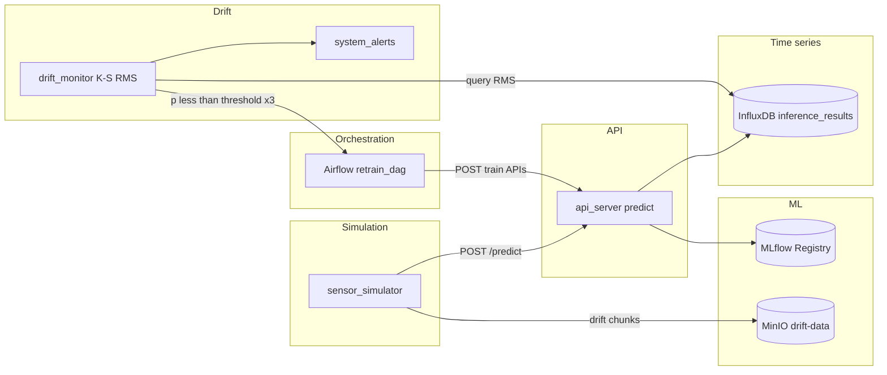

# CWRU Bearing Fault — MLOps Pipeline

Demo pipeline quanh bài toán phân loại lỗi ổ bi (CWRU): **mô phỏng cảm biến** → **suy luận qua API** → **lưu chuỗi thời gian (InfluxDB)** → **phát hiện drift (K–S trên RMS)** → **cảnh báo + kích hoạt Airflow** → **feature engineering / train lại / promote model (MLflow Registry)** → **MinIO** cho drift data và artifact.

## Kiến trúc tổng quan



## Yêu cầu

| Thành phần | Ghi chú |
|------------|---------|
| **Docker** + **Docker Compose** | Bắt buộc để chạy full stack |
| **Node.js** (LTS) | Chỉ cần khi build dashboard (`npm run build`) |
| **Conda** (tùy chọn) | Tạo env từ [environment.yml](environment.yml) (`conda env create -f environment.yml`) cho dev Python cục bộ |

## Cài đặt nhanh

1. **Clone repository**

   ```bash
   git clone <your-fork-url>
   cd ddm_pipeline
   ```

2. **Cấu hình biến môi trường**

   ```powershell
   Copy-Item .env.example .env
   ```

   Chỉnh mật khẩu và token trong `.env`. Token InfluxDB phải **khớp** với giá trị đã khởi tạo bucket/org (và với các script đọc Influx nếu bạn đồng bộ tay).

3. **Build dashboard** (Nginx phục vụ static từ `dashboard/dist`; thư mục `dist` không commit):

   ```bash
   cd dashboard
   npm ci
   npm run build
   cd ..
   ```

4. **Khởi động stack**

   ```bash
   docker compose up -d
   ```

   (Hoặc `docker-compose up -d` tùy phiên bản.)

5. **Kiểm tra API qua Nginx**

   ```text
   GET http://localhost/api/health
   ```

## URL và dịch vụ (qua Nginx :80)

| Mục | URL |
|-----|-----|
| Dashboard điều khiển sim | `http://localhost/dashboard/` |
| API (health, sim, drift, train) | `http://localhost/api/...` |
| Grafana | `http://localhost/grafana/` |
| Airflow | `http://localhost/airflow/` |
| MLflow UI | `http://localhost/mlflow/` |
| MinIO Console | `http://localhost:9001` (API S3: `:9000`) |

API backend lắng nghe trong container tại `/health`, `/predict`, … — client chỉ gọi qua tiền tố **`/api/`** (Nginx strip prefix).

## Luồng vận hành (demo)

### 1. Chuẩn bị dữ liệu và train baseline (2 lớp: Normal + Ball)

Trong container `api_server` (hoặc môi trường đã mount `./data` và `./scripts`):

```bash
docker compose exec api_server python scripts/feature_engineering.py --mode baseline
docker compose exec api_server python scripts/model_training.py --epochs 3
```

Đăng ký model lên MLflow diễn ra trong script train; alias production có thể gán trong MLflow UI hoặc qua API promote.

### 2. Nạp model phục vụ suy luận

```http
POST http://localhost/api/model/reload
```

### 3. Simulator và drift IR (Inner Race)

- **Start** simulation từ dashboard (hoặc `POST /api/sim/start`).
- **Không** bật drift ngay: để chạy **một khoảng thời gian** (ví dụ ~60–90 giây) chỉ dữ liệu “ổn định” để InfluxDB tích **baseline RMS** (`drift_active == false`) cho `drift_monitor`.
- Bật **Simulate Drift**: trộn dần **IR** (Inner Race) với Normal trong [scripts/sensor_simulator.py](scripts/sensor_simulator.py); đồng thời có thể upload chunk lên MinIO bucket `drift-data`.

### 4. Phát hiện drift

- [scripts/drift_monitor.py](scripts/drift_monitor.py) dùng **hai mẫu Kolmogorov–Smirnov** trên trường **RMS** (baseline vs cửa sổ gần đây), **không** dùng confidence của classifier.
- Khi `p_value` nhỏ hơn ngưỡng đủ lần liên tiếp: ghi `system_alerts`, có thể gọi Airflow `retrain_dag`.

**Grafana** vẫn có thể hiển thị confidence — đó là metric quan sát; **điều kiện trigger tự động** trong code hiện tại là phân phối RMS.

### 5. Retrain (DAG)

[scripts/airflow_dags/retrain_dag.py](scripts/airflow_dags/retrain_dag.py) gọi API: feature engineering (`--mode retrain`, kéo drift từ MinIO), training, promote. Sau promote, API có thể hot-reload model tùy cấu hình.

## Phát triển cục bộ (Python)

```bash
conda env create -f environment.yml
conda activate ddm_pipeline
```

(File `*.ps1` không nằm trong repo — khai báo trong `.gitignore`.)

Stack inference/production vẫn nên kiểm tra qua Docker.

## Troubleshooting

| Hiện tượng | Gợi ý |
|------------|--------|
| `502` từ `/api/*` sau khi restart container | Nginx dùng DNS động cho `api_server`; restart `nginx` hoặc đợi vài giây. |
| Drift không bao giờ “đủ dữ liệu” | Cần đủ điểm RMS baseline trước khi bật drift; xem log `drift_monitor`. |
| Dashboard trống sau clone | Chạy `npm ci && npm run build` trong `dashboard/`. |
| Đổi `.env` | Khởi động lại các service phụ thuộc; đảm bảo token InfluxDB thống nhất với DB đã tạo. |

## Cấu trúc thư mục (rút gọn)

| Đường dẫn | Mô tả |
|-----------|--------|
| [docker-compose.yml](docker-compose.yml) | Định nghĩa toàn bộ service |
| [nginx/nginx.conf](nginx/nginx.conf) | Reverse proxy, `/api/` → FastAPI |
| [scripts/](scripts/) | `api_server.py`, `sensor_simulator.py`, `drift_monitor.py`, `feature_engineering.py`, `model_training.py`, `ml_utils.py` |
| [scripts/airflow_dags/](scripts/airflow_dags/) | DAG Airflow |
| [dashboard/](dashboard/) | React + Vite |

Thư mục tên bắt đầu bằng `ddm` ở root (báo cáo khóa học, v.v.) được loại khỏi git theo [.gitignore](.gitignore).

## Đẩy lên GitHub

```bash
git init
git add .
git status   # đảm bảo .env và data/generated không nằm trong commit
git commit -m "Initial commit: MLOps pipeline, README, gitignore"
git remote add origin https://github.com/<user>/<repo>.git
git branch -M main
git push -u origin main
```

Không commit file `.env`. Chỉ commit `.env.example`.

## Giấy phép

Thêm file LICENSE nếu repo công khai yêu cầu.
